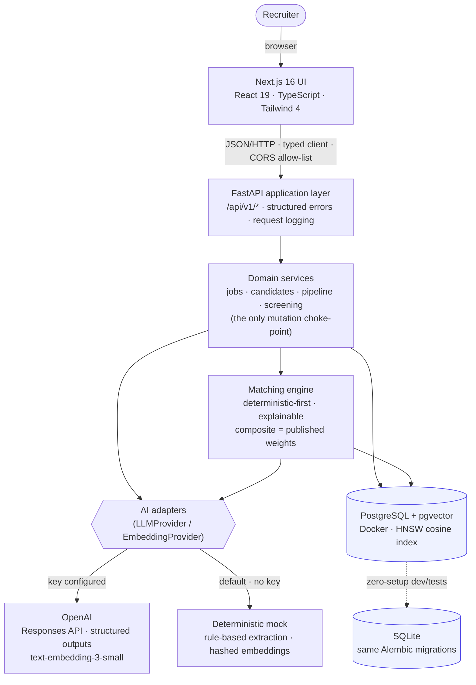
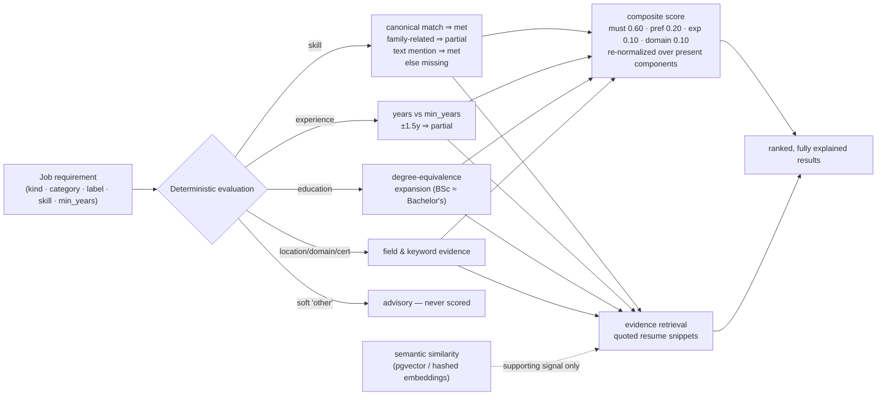

# Architecture — TalentFlow AI

> Decision records for the choices below live in `docs/adr/`. This document is
> the map; the ADRs are the reasoning.

## 1. System context



The full request path the audit was asked to trace:

```text
Recruiter → Next.js frontend → FastAPI (/api/v1) → domain services
        → matching engine (deterministic evaluation + evidence, semantic
          similarity as supporting signal)
        → AI adapters (OpenAI when configured, deterministic mock by default)
        → PostgreSQL + pgvector (embeddings, HNSW cosine index)
        → ranked, fully explained match results back to the browser.
```

## 2. Backend layering (modular monolith — ADR 0001)

```text
app/
├── main.py            FastAPI factory: routers, CORS, middleware, errors
├── core/              config, structured logging, error taxonomy, date helpers
├── db/                declarative base, engine/session (dialect-aware)
├── models/            SQLAlchemy 2.0 ORM models (the data model below)
├── schemas/           Pydantic request/response schemas (the API contract)
├── ai/                provider interfaces + OpenAI & mock implementations
├── services/          domain logic — the ONLY place that mutates data:
│                        job_service, candidate_service, pipeline, screening,
│                        matching (+ matching_evidence), normalization,
│                        documents (ingestion), embeddings_store, skills
├── api/               routers (thin), deps, middleware, serializers
└── seed/              synthetic demo data + seeder (python -m app.seed)
```

Rules enforced by review (and tests):

* routers never touch models directly — everything goes through services;
* AI providers are never imported by services except through the `app/ai/base`
  interfaces;
* unstructured text (resumes/JDs) is data, never instructions (see SECURITY.md);
* the database never stores raw model output as truth — normalization +
  Pydantic validation gate every write (ADR 0002).

## 3. Data model

```text
Candidate ──1:N── CandidateExperience / CandidateEducation / CandidateSkill /
                  CandidateCertification
Candidate ──M:N── Tag (candidate_tags)
Candidate ──1:N── CandidateNote                (optionally job-scoped)
Candidate ──1:N── Application ──N:1── Job ──1:N── JobRequirement
Application ──1:N── PipelineStageEvent          (audit trail of stage moves)
Application ──1:N── ScreeningQuestion           (generated sets)
EmbeddingRecord  (owner_type ∈ candidate|job, owner_id, chunk_index, vector)
```

* `Application.stage` holds the current stage (`NEW … REJECTED`, stored as
  plain uppercase strings for portability); `PipelineStageEvent` is the
  append-only history behind the board and the dashboard activity feed.
* Skills are stored canonicalized (`normalized_name`) + as-written (`name`) +
  an `evidence` line; a unique constraint prevents duplicates per candidate.
* `embedding_records` is the only dialect-specific table — see §6.
* There is deliberately **no column anywhere** for age, gender, nationality,
  ethnicity, religion, marital status, disability or photos. A test asserts it.

## 4. Request flows

### 4.1 Resume → structured profile

```text
upload (PDF/DOCX/TXT)                    services/documents.extract_text
   │  size/type checks, text extraction, sanitization (untrusted!)
   ▼
LLM extraction (provider interface)      OpenAI structured outputs ─or─ mock rules
   ▼
normalization + validation               services/normalization.normalize_candidate
   │  canonical skills, dedup, range checks, Pydantic gate
   ▼
persistence (single transaction)         candidate_service.ingest_resume
   │  candidate + children + embeddings (chunked, deterministic ids)
   ▼
API response                             schemas/candidate.py (validated)
```

### 4.2 JD → structured job

Same pipeline with `normalize_job`; requirements land as evaluable rows:
`{kind: must_have|preferred, category: skill|experience|education|
certification|domain|location|other, label, normalized_skill, min_years,
keywords}`.

### 4.3 Matching (ADR 0003 — the algorithm)



The per-requirement evaluation in detail:

```text
              ┌────────────────────────────────────────────────────┐
 per requirement: │ 1. deterministic evaluation                   │
              │    skill      → exact canonical match (aliases) │
              │                 → related family ⇒ partial      │
              │                 → resume-text mention ⇒ met      │
              │    experience → years vs min_years (±1.5y ⇒ part)│
              │    education  → degree-equivalence expansion     │
              │    location   → field match / remote             │
              │    domain     → keyword evidence in profile      │
              │    other      → advisory (soft signal only)      │
              │ 2. evidence retrieval — quoted source snippets   │
              │ 3. semantic similarity (supporting signal only)  │
              └───────────────┬────────────────────────────────────┘
                              ▼
 composite = Σ(weight × component) re-normalized over present components
 must_have ×0.60 · preferred ×0.20 · experience ×0.10 · domain ×0.10
```

Properties (all unit-tested):

* deterministic: same inputs → same result, no hidden state;
* semantic similarity is reported but **cannot** turn a missing requirement
  into a met one;
* soft ("other") requirements are labeled advisory and excluded from the score;
* every status carries a human-readable reason and, where applicable, evidence
  whose snippet literally appears in the candidate's resume text;
* no hire/no-hire output exists in the API surface.

### 4.4 Pipeline moves

`PATCH /applications/{id}/stage` → validated against the stage enum, writes an
event row, returns the application with its full trail. Same-stage moves are
no-ops; invalid stages are a structured 422.

## 5. Frontend architecture

```text
src/
├── app/            App Router pages (client components):
│                     / dashboard   /jobs  /jobs/new  /jobs/[id]
│                     /candidates  /candidates/[id]
│                     /matching    /pipeline  /screening  /health
├── components/
│   ├── shell/      sidebar + layout
│   ├── ui/         Button, Card, Badge, Fields, States, StatCard
│   ├── jobs/       JobForm (paste/upload tabs)
│   ├── candidates/ profile sections, notes/tags, screening, matched jobs
│   ├── matching/   MatchCard (score breakdown, formula, evidence rows)
│   └── pipeline/   StageControls
├── hooks/useApi.ts typed fetch hook (request-id guarded, reload semantics)
└── lib/            api.ts (typed client), types.ts (mirrors Pydantic schemas),
                    format.ts (display helpers)
```

Conventions: every page implements **empty / loading / error / success**
states; server state is fetched client-side through the typed client so the
browser talks to the published API port directly (CORS allow-list in config).

## 6. Database portability (ADR 0001/0004)

| concern        | PostgreSQL (runtime)                          | SQLite (dev/tests)                    |
|----------------|-----------------------------------------------|---------------------------------------|
| vector column  | `vector(1536)` (pgvector, HNSW index)         | JSON text                             |
| similarity     | SQL `embedding <=> CAST(:vec AS vector)`      | in-process cosine (NumPy)             |
| migrations     | identical Alembic migration (dialect-guarded) | identical migration (`render_as_batch`)|
| foreign keys   | native                                        | `PRAGMA foreign_keys=ON` per connection |

The type decorator lives in `app/models/embedding.py`; the search branch in
`app/services/embeddings_store.py::search_similar`. Nothing else in the
codebase knows which database is in use.

## 7. Configuration & operations

* `Settings` (pydantic-settings): env vars > `.env` > safe defaults (SQLite +
  mock AI). One file: `app/core/config.py`; documented in `.env.example`.
* Logging: structured key=value (or JSON via `LOG_FORMAT=json`); request
  middleware logs method/path/status/duration — bodies are never logged.
* Health: `/api/v1/health/live` (probe) + `/api/v1/health` (db latency,
  dialect, AI mode, counts; no secrets).
* Docker: API container runs `alembic upgrade head` on start (see
  `docker-entrypoint.sh`); DB and uploads are named volumes.

## 8. Testing strategy

See `TESTING.md` for the full matrix. Shape of it (final audit numbers,
28 Sep 2026: **95/95 backend tests pass against PostgreSQL, 94 pass + 1
integration on SQLite, 18/18 frontend, coverage 91%**):

* unit: skill taxonomy, normalization, mock extraction, matching guarantees,
  embeddings math, document decoding;
* API/integration: every router (including error shapes), pipeline audit trail,
  screening lifecycle, health;
* migration round-trip on a throwaway database;
* PostgreSQL+pgvector integration test (runs against the Docker database
  locally and the CI service container remotely) + dialect-level SQL compile
  checks that run everywhere;
* frontend: component tests (match card, stage controls, badges) and client
  error-handling tests;
* manual acceptance: documented checklist executed against a live stack with
  screenshots (`docs/screenshots/`), including a full wipe-and-rebuild
  Docker clean-start run.
