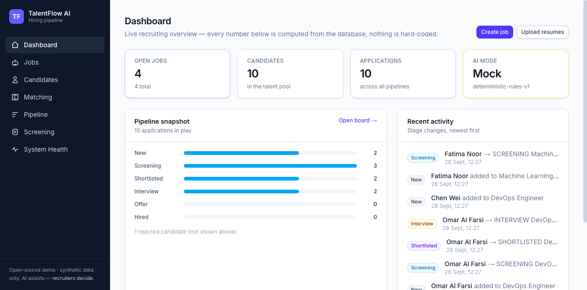
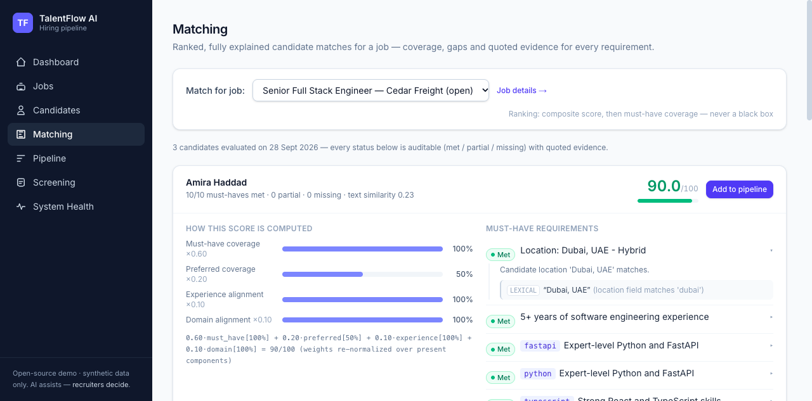
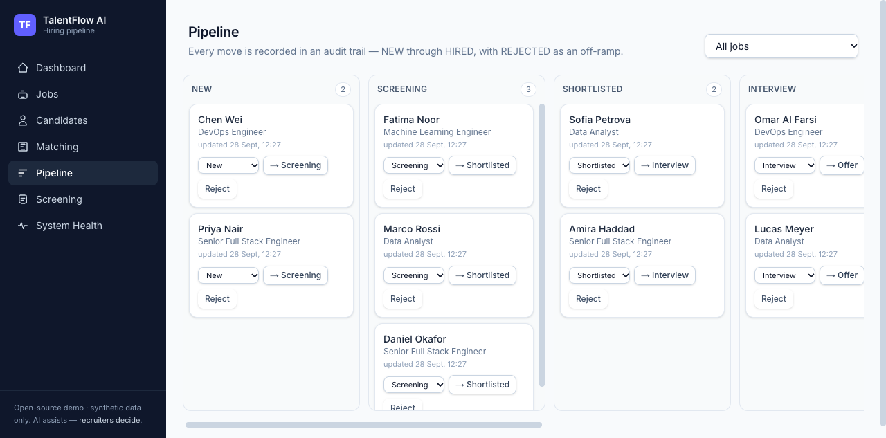
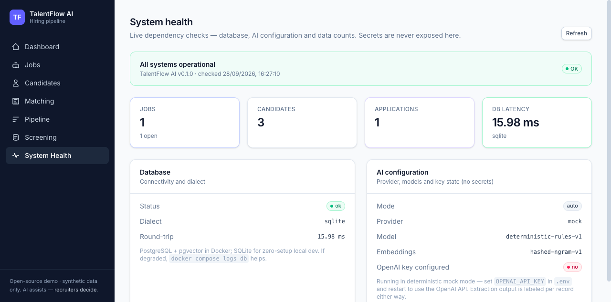

# TalentFlow AI

**Open-source AI-native hiring pipeline and explainable candidate matching platform.**

[](https://github.com/OWNER/talentflow-ai/actions/workflows/ci.yml)


TalentFlow AI ingests job descriptions and resumes, turns them into **validated
structured talent data**, performs **explainable candidate-to-job matching**, and
lets a recruiter manage candidates through a hiring pipeline — NEW → HIRED —
with evidence, notes, tags and candidate-specific screening questions.

Two things make it different from a typical "AI hiring" demo:

1. **No mysterious AI score.** Matching is deterministic-first: every
   requirement gets `met / partial / missing / unknown` with a written reason
   and quotes from the candidate's own resume. The composite score shows its
   formula and weights right in the UI. The recruiter decides — the AI assists.
2. **It runs anywhere, honestly.** Without an OpenAI key it runs in a fully
   deterministic **mock mode** (clearly labeled everywhere); with a key it uses
   the current OpenAI API with structured outputs. Tests never need a network.

<!-- Screenshots (see docs/screenshots/) -->
| Dashboard | Explainable matching |
|---|---|
|  |  |

| Pipeline board | System health |
|---|---|
|  |  |

---

## The problem

Recruiting teams drown in unstructured text: job descriptions and hundreds of
resumes, none of it queryable, comparable or auditable. The products that
promise to fix this with a single opaque "AI match score" make hiring **less**
accountable, not more. TalentFlow AI demonstrates the opposite approach:

* structure first — validated data models, never raw model output as truth;
* explainability always — coverage, gaps and source evidence per requirement;
* human authority — the platform never issues a hire / no-hire verdict;
* responsible AI by construction — protected characteristics are excluded from
  the schema, the matching engine and the prompts (see `RESPONSIBLE_AI.md`).

## Features

**Recruiting workflow**

* **Jobs** — create from pasted text or an uploaded JD (PDF/DOCX/TXT);
  requirements are extracted into must-have vs preferred with skills, years,
  education, location and domain signals.
* **Candidates** — multi-file resume upload; PDF/DOCX/TXT parsing into
  validated profiles: experience timeline, education, certifications, skills
  (with an evidence line for each), and computed years of experience.
* **Matching** — ranked, requirement-by-requirement evaluation with quoted
  evidence, component breakdown and a documented composite formula. Semantic
  similarity (pgvector / hashed embeddings) is a supporting signal — it never
  overrides a deterministic miss.
* **Pipeline** — NEW / SCREENING / SHORTLISTED / INTERVIEW / OFFER / HIRED /
  REJECTED board with an audit trail of every stage move.
* **Notes & tags** — recruiter notes with author and timestamps; colored tags.
* **Screening questions** — generated per application, grounded in match
  results (strongest matches, honest gap probes, seniority-calibrated
  behavioral questions), each with a rationale.
* **System health** — live database, AI configuration and data-count checks;
  no secrets are ever exposed.

**Engineering**

* FastAPI + Pydantic v2 + SQLAlchemy 2.0 backend; Next.js 16 + React 19 +
  TypeScript + Tailwind 4 frontend.
* PostgreSQL + pgvector in Docker; zero-setup SQLite fallback for local dev
  and tests (same migrations for both).
* LLM/embedding providers behind interfaces (`app/ai/base.py`) with a
  deterministic offline mock — no key required, tests fully hermetic.
* 95 backend tests (91% coverage) + 18 frontend tests + CI on GitHub Actions
  running the full suite against real PostgreSQL + pgvector.

## Quick start

### Option A — Docker Compose (full stack, PostgreSQL + pgvector)

```bash
git clone <your-fork-url> talentflow-ai && cd talentflow-ai
cp .env.example .env            # optional — every value has a safe default
docker compose up --build -d    # builds api + web + db
docker compose exec api python -m app.seed   # load the synthetic demo dataset
```

> Works with **any Docker daemon** — Docker Desktop, [Colima](https://github.com/abiosoft/colima)
> (fully CLI, no license gate), or a remote daemon. The compose stack was
> verified end-to-end against Colima + the `pgvector/pgvector:pg16` image.

Open **http://localhost:3000** (UI) and **http://localhost:8000/docs** (API).
No OpenAI key needed — the default is deterministic mock mode.

### Option B — native dev (no Docker, SQLite)

```bash
cp .env.example .env
cd backend && uv sync && uv run alembic upgrade head && uv run python -m app.seed && cd ..
cd frontend && npm install && cd ..
make dev        # starts API (:8000) + web (:3000) together
```

Requirements: Python 3.12 (via [uv](https://docs.astral.sh/uv/)), Node 20+.

### Enabling the OpenAI path (optional)

```bash
# .env
OPENAI_API_KEY=sk-...        # AI_PROVIDER=auto picks it up
```

`AI_PROVIDER` can be `auto` (default), `openai` or `mock`. Whatever produced a
record is stored and displayed (`extraction_method`), so mock and real data are
never silently mixed. Defaults: `gpt-5.6-terra` for extraction,
`text-embedding-3-small` (1536-dim) for embeddings.

## Demo data

`python -m app.seed` (or `make seed` with Docker) creates a **fully synthetic**
dataset — 4 fictional job postings and 10 fictional candidates whose resumes
exist as real PDF/DOCX/TXT files in `examples/resumes/` and are ingested
through the *same pipeline a real upload uses*. `--reset` wipes and rebuilds.
No real person's data is ever included.

## Testing

```bash
make test                # backend (pytest) + frontend (vitest + typecheck)
cd backend && uv run pytest                       # 95 tests, 91% coverage
cd frontend && npm test && npm run typecheck      # 18 tests + strict TS
cd backend && uv run python scripts/smoke_api.py  # end-to-end flow, human-readable
```

CI additionally runs the whole backend suite against **PostgreSQL + pgvector**
and builds all Docker images — see `.github/workflows/ci.yml` and
`TESTING.md` for the full matrix and the manual acceptance workflow.

## Architecture

```text
Browser (Next.js App Router, typed API client)
        │  JSON over HTTP (CORS)
        ▼
FastAPI application layer  ── structured errors, request logging
        │
        ▼
Domain services            ── jobs, candidates, pipeline, screening
        │      │
        │      └── matching engine (deterministic-first, explainable)
        ▼
AI adapter layer           ── OpenAI (structured outputs) │ deterministic mock
        │
        ▼
PostgreSQL + pgvector (runtime) │ SQLite (dev/tests) — same Alembic migrations
```

Full details: **`ARCHITECTURE.md`** (layers, data model, matching algorithm,
dialect strategy), **`AI_DESIGN.md`** (prompts, schemas, mock determinism,
embeddings), **`API.md`** (endpoint reference).

### Repository layout

```text
backend/    FastAPI app, domain services, AI adapters, migrations, tests, seed
frontend/   Next.js app: 9 pages (dashboard, jobs, candidates, matching,
            pipeline, screening, health) + typed client + UI kit
docs/       ADRs, screenshots, deep-dive documentation
examples/   Synthetic demo JDs + resume files (PDF/DOCX/TXT)
scripts/    dev launcher
```

## Responsible AI

TalentFlow AI is built so that automated bias has nowhere to hide:
no protected-attribute columns exist anywhere in the schema, the engine refuses
to use or infer them, prompts explicitly exclude them, and every automated
judgement is traceable to quoted source evidence. The platform never makes a
hire/no-hire decision. Read **`RESPONSIBLE_AI.md`** — it is the contract.

## Roadmap

* Authentication + multi-tenant workspaces (the service layer is ready for it).
* Interview scheduling and structured interview scorecards.
* Email/ATS integrations and CSV export.
* Next.js 16 ahead-of-time route improvements; incremental static rendering for
  the dashboard.
* Optional reranking evaluation harness for the OpenAI provider.

## License & contributing

MIT — see `LICENSE`. Contributions welcome: see `CONTRIBUTING.md`, and please
read `SECURITY.md` before reporting anything sensitive. The demo data is
synthetic; never contribute real candidate information.
